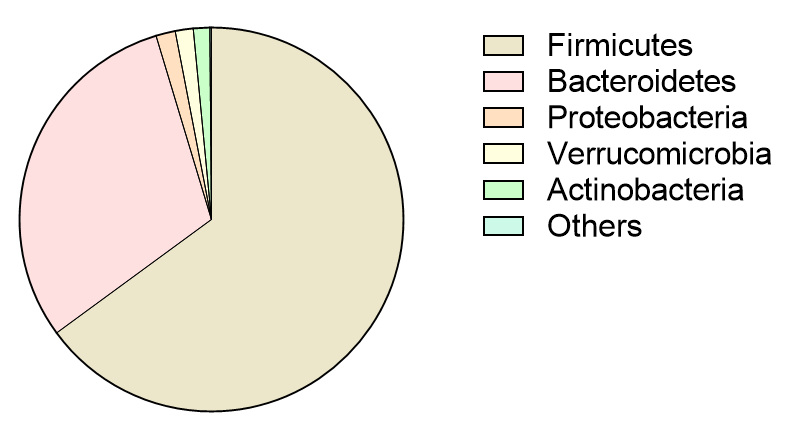

# Background Information

The human gut is home to trillions of microorganisms that form the gut microbiota, including bacteria, fungi, viruses, and protozoa, that coexist symbiotically with their human host. This delicate ecosystem is essential in maintaining our health, influencing everything from digestion to metabolism, immune function, and mental health (Thursby & Juge, 2017). A normal gut microbiota composition is shown below in Figure 1.

<i>Figure. 1 Normal gut microbiota composition.</i>

When the balance of intestinal microbial community composition is disrupted, known as gut dysbiosis, various gastrointestinal diseases might happen due to changes in metabolite production and interspecific competition. Various diseases and ailments such as Inflammatory Bowel Disease (IBD), colorectal cancer, Major Depressive Disorder (MDD), obesity, and autism are all related to gut dysbiosis (Madhogaria B. et al., 2022). Gut dysbiosis-related diseases have also become increasingly prevalent in recent years, particularly in China, as shown in Figure 2 (Yang et al., 2022; J. Li et al., 2022; N. Li et al., 2021; Zhao et al., 2021). 

*Figure 2. Prevalence of gut dysbiosis-related disease in China*

Current approaches to treating gut dysbiosis include taking antibiotics and fecal microbiota transplantation, while milder approaches include taking probiotics, taking prebiotics that promote probiotic growth, and changing lifestyle to attenuate inflammation (Sultan et al., 2021; Hrncir, 2022; Wei et al., 2021). These methods are not mutually exclusive and are often combined to achieve a full recovery.

# Problems Faced 

As shown above, gut dysbiosis is associated with multiple diseases. However, the screening for dysbiosis is insufficient, leading to failures in prevention and early identification of severe deterioration. Additionally, the treatment of gut dysbiosis is not fully developed - for now, most dysbiosis treatments favor the introduction of general probiotics such as Lactobacillus and Bifidobacterium (Bull et al., 2015), combined with drugs targeting the specific diseases. However, the gut environment is unique for each individual and very complex in composition. Thus, it is demanding for current therapies such as general antibiotics or probiotics to satisfy individual specific needs. In addition, these approaches also require periodic consultations with healthcare professionals to proscribe medicine and adjust the therapeutic schedule so that full recovery is ensured. This could be expensive, time-consuming, or inconvenient for patients. Moreover, some gut dysbiosis-related diseases, such as IBD, are not curable. Without continuous monitoring and treatment, the risk of relapse and harm accumulation is high.

The ineffectiveness of current medication and prevalent side effects emphasize the urgent need for novel, less invasive treatments. As gut dysbiosis diseases are hard to cure fully, relapses could happen frequently, while current treatments are only administered after the body exhibits initial symptoms of suffering. Thus, it is also important to develop long-term medication that could constantly monitor the gut environment, detect preliminary signs of harm, intervene, and restore balance before true pain occurs.

Thus, we envisage a probiotic platform colonizing the human gut to alleviate a wide range of gut dysbiosis-related diseases.

# Our Solution

Our project aims to produce alimentary products that carry an *in vivo*, long-term effective, flexible, and multi-potent probiotic platform, regulating the gut microbiome to identify, prevent, and even treat harm from gut microbiome dysbiosis. Engineered metabolite biosensors strictly control the output of mediator substances, enabling the platform to detect the complex and dynamic conditions of gut microbiota dysbiosis and execute its regulatory functions.

Compared to existing treatment options, our platform has improvements. As explained, our platform aims at the regulation of the gut microbiome and its metabolites already existing in the patient rather than the introduction of outer drugs. These microbes and metabolites are normally found in the human body, so the approach is most natural and non-invasive, minimizing any side effects caused by artificial ingredients. Utilizing a living probiotic as our platform has special advantages. Living organisms are known for their ability to sensitively perceive environmental changes. Our platform leverages this capability to monitor slight changes in the gut in real time and regulate responses according to the patient's specific conditions. Through colonization, our probiotics will be able to establish a long-term presence in the human gut. This not only provides continuous surveillance to prevent relapses but also reduces intake frequency to a single administration. 

1. ## Platform Construction

Our probiotic would be able to colonize the human intestines and exert a long-term stabilizing effect through the regulatory platform integrated into the probiotic's genome. Our probiotic will be able to detect multiple intestinal conditions timely and determine whether dysbiosis exists*.* If a suspected dysbiosis is detected, the probiotic would try to relieve the conditions of dysbiosis. 

The detection and regulatory effect of the platform would be achieved by multiple input biosensors and output effectors. Moreover, the input sensors and output effectors on the platform can be adjusted and replaced according to specific conditions of dysbiosis. 

Input sensors can misinterpret signals, for example, they may misinterpret intervals between food uptake, when the gut microbiome is not actively metabolizing as a deficiency in important metabolite production by the host's gut microbiome. Consequently, the output effectors might erroneously express enzymes for metabolite production when there is insufficient material and energy available for our probiotic to produce the metabolite, thereby increasing the burden on the metabolite. To prevent such misinterpretations and misproductions, a sensor is designed to detect the presence of chyme in the intestines. This is achieved by monitoring bile acid concentrations, which are released by the gall bladder when chyme enters the duodenum. The bile acid sensor acts as a regulatory switch for the genetic system.

In our project, we designed and tested biosensors and expressed mediators to provide usage protocols for the platform, demonstrating strict regulation and effectiveness.

### **Integration\Implementation** 

We designed two genetic systems and demonstrated that these circuits could be effective for the delivery of therapeutic molecules in the gut, both in the absence and excess of specific metabolites caused by microbiota dysbiosis.

*Figure 3. Genetic system targets absent specific metabolites caused by microbiota dysbiosis, dysbiosis-related IBD*

We first demonstrate our platform's use in alleviating inflammatory bowel disease-related dysbiosis. Quorum sensing molecules, specifically N-Acyl homoserine lactone (AHL), particularly 3-oxo-C12:2, not only reflect microbiota dysbiosis due to their erratic fluctuations but also serve as effective and specific indicators of IBD symptoms, with low density correlating with the presence of symptoms. Additionally, short-chain fatty acids (SCFAs) are among the most relevant metabolites produced by gut microbiota for intestinal function. SCFAs, primarily produced by anaerobic bacterial fermentation, have been shown to maintain intestinal homeostasis due to their anti-inflammatory and protective effects on the intestinal epithelium, and they participate in the regulation of multiple cellular processes. Lower concentrations of SCFAs have been observed in patients with IBD. Among various SCFAs, butyrate is known to repair damaged gut cells associated with IBD. Our engineered bacteria will detect low concentrations of AHL and butyrate for IBD-related dysbiosis identification. Upon detecting these signals, the bacteria will produce and release the butyric acid when bile acid indicates food ingestion and provides energy for butyrate production, aiming to regulate SCFA levels and alleviate the harm caused by microbiota dysbiosis in the human gut.

*Figure 4.* 

The second usage example we provided focuses on IAA's drastic effects on microbiota. Although small quantities of IAA are beneficial to the gut environment, large concentrations of IAA are related to increased psychological stress (Wei et al., 2024). Therefore, we incorporated the repressor IacR which is sensitive to changes in IAA concentrations into the genetic circuit. Although reducing the specific IAA-producing bacteria population is preferable, directly reducing IAA concentration is feasible for our project. Therefore, we express an IAA-degrading enzyme when detecting both bile acid and excess IAA signals, as shown in Figure 4.

Overall, these genetic systems may function as complementary diagnostic tools. 

1. ## Testing Module

### **Input (Sensors)**

####  Bile Acid Detection  Promoter pJexD is modified to detect deoxycholic acid (DCA) in the human gut (Taketani et al., 2020). The concentration of DCA will directly activate the entire genetic system.  

####  Quorum Sensing Molecule Detection  A new AHL, the 3-oxo-C12:2 homoserine lactone (3-oxo-C12:2), was found to be over-represented in healthy subjects compared to dysbiosis-related IBD patients. The fluctuation of AHL concentration in the gut underscores the need for sensitive detection methods for the needs of platform construction.   There is no existant biosensor known to have the ability to bind our desired AHL 3-oxo-C12:2. Most AHL sensors target the harmful 3-oxo-C12-HSL produced by *P. aeruginosa.* Thus, we employ mathematical modeling to screen for possible receptors.

 *Figure 5. Chemical structure of 3-oxo-C12:2 (Aguanno et al., 2020)*

*Figure 6. 3D structure of 3-oxo-C12:2 drawn by Discovery Studio*

  After screening, we identified a protein that best binds to 3-oxo-C12:2. 

 *Figure 7. 3D structure of our designed protein*

 *Figure 8. Binding of 3-oxo-C12:2 with designed protein*

####  Short-Chain Fatty Acid Detection  Short-chain fatty acids (SCFA) such as propionate and butyrate are critical metabolites produced by the gut microbiota. Microbiome dysbiosis resulting in altered SCFA profiles is associated with certain diseases, including IBD, characterized by a reduction in butyrate concentration and active intestinal inflammation. We used molecular biosensors that quantify the absence of butyrate, utilizing logic 'NOT' gates and bacterial promoters. Promoter PpchA is derived from the part registry BBa_K4442001, and pHpdR is derived from a previous study (Wang et al., 2023). These promoters are used to sense SCFA concentrations and express the response protein Tes4 for SCFA production in amounts inversely proportional to the SCFA concentration.  BBa_K4442001超链接到：https://parts.igem.org/Part:BBa_K4442001

####    Indole-3-acetic Acid Detection

 We developed genetic circuits capable of sensing indole-3-acetic acid concentrations. The design contains a repressor IacR, which loses its repressing function in response to IAA. This system is used to sense IAA concentrations and induce the expression of the output proteins to degrade IAA when IAA is in excess, relieving harm from excess IAA. 

### **Output (Production\degradation)** 

####  Short-Chain Fatty Acid Production  Upon sensing the absence of SCFA and insufficient levels of SCFA-producing bacteria, the genetic system will express SCFA for regulating, specifically butyric acid, in response.   An acyl-ACP thioesterase Tes4 (part BBa_K3838613) from Bacteroides fragilis is employed to produce butyrate. Tes4 acts on the butyryl-ACP generated by the native fatty acid biosynthesis (FASII) pathway, releasing the tetracarbon acid from ACP to result in butyric acid production.  *Figure 9. Butyrate production pathway (Kallio P. et al., 2014)*  Previous studies found heterologous expression of Tes4 in E. coli K27 generates low quantities of butyrate (Jing F. et al., 2011), while expressing the enzyme in E. coli BL21 produces butyrate as the main product (Kallio P. et al., 2014). Compared to alternative pathways requiring multiple enzymes, expressing this single Tes4 could achieve butyrate production, so it lowers stress on our engineered probiotic.   Part BBa_K3838613超链接：https://parts.igem.org/Part:BBa_K3838613

####    Indole-3-acetic Acid Degradation  Upon sensing excessive levels of IAA, the genetic system will express IAA-degrading enzymes to maintain the concentration of IAA within a reasonable value. IadCDE operons from IAA-degrading bacteria encode proteins responsible for IAA degradation (Conway et al., 2022; Scott et al., 2013). We place genes iadCDE downstream to the inducible promoter PiacR to be induced by high concentrations of IAA in the gut environment. When overexpressed, IAA is degraded with the expression of *i*adCDE. 

1. ## Other Concerns

Once introduced into the human gut, the engineered bacteria will colonize and demonstrate a long-term effect in treating IBD. To prevent potential contamination from unexpected leakage, we have designed a cold-inducible kill-switch system that triggers self-destruction of the bacteria when excreted and exposed to lower temperatures. This strategy enhances the effectiveness and safety of the treatment. Additionally, we decided to use well-studied and widely-used probiotic E.coli Nissle 1917 as our chassis, ensuring our engineered bacteria itself won't pose any threat to the human body.

# References

Madhogaria, Barkha & Bhowmik, Priyanka & Kundu, Atreyee. (2022). Correlation between human gut microbiome and diseases. Infectious Medicine. 1. https://doi.org/10.1016/j.imj.2022.08.004

Thursby, E., & Juge, N. (2017). Introduction to the human gut microbiota. The Biochemical Journal, 474(11), 1823–1836. https://doi.org/10.1042/BCJ20160510

Sultan, S., El-Mowafy, M., Elgaml, A., Ahmed, T. a. E., Hassan, H., & Mottawea, W. (2021). Metabolic influences of gut microbiota dysbiosis on inflammatory bowel disease. Frontiers in Physiology, 12. https://doi.org/10.3389/fphys.2021.715506

Hrncir, T. (2022). Gut microbiota dysbiosis: Triggers, consequences, diagnostic and therapeutic options. Microorganisms, 10(3), 578. https://doi.org/10.3390/microorganisms10030578

Wei, L., Singh, R., Ro, S., & Ghoshal, U. C. (2021). Gut microbiota dysbiosis in functional gastrointestinal disorders: Underpinning the symptoms and pathophysiology. *JGH Open*, *5*(9), 976–987. https://doi.org/10.1002/jgh3.12528

Yang, H., Zhou, R., Bai, X., Guo, M., Ruan, G., Wang, L., & Qian, J. (2022). Trend and geographic variation in incidence and prevalence of inflammatory bowel disease in regions across China: a nationwide employee study between 2013 and 2016. *Frontiers in Medicine*, *9*. https://doi.org/10.3389/fmed.2022.900251

Li, J., Shi, Q., Gao, Q., Pan, X., Zhao, L., He, Y., Tian, H., Zhu, Z., & Li, S. (2022). Obesity pandemic in China: epidemiology, burden, challenges, and opportunities. *Chinese Medical Journal/Chinese Medical Journal*, *135*(11), 1328–1330. https://doi.org/10.1097/cm9.0000000000002189

Li, N., Lu, B., Luo, C., Cai, J., Lu, M., Zhang, Y., Chen, H., & Dai, M. (2021). Incidence, mortality, survival, risk factor and screening of colorectal cancer: A comparison among China, Europe, and northern America. *Cancer Letters*, *522*, 255–268. https://doi.org/10.1016/j.canlet.2021.09.034

Zhao, Y., Jin, Y., Rao, W., Zhang, Q., Zhang, L., Jackson, T., Su, Z., Xiang, M., Yuan, Z., & Xiang, Y. (2021). Prevalence of major depressive Disorder among adults in China: A Systematic Review and Meta-Analysis. *Frontiers in Psychiatry*, *12*. https://doi.org/10.3389/fpsyt.2021.659470

Bull, M. J., & Plummer, N. T. (2015). Part 2: Treatments for chronic gastrointestinal disease and gut dysbiosis. *PubMed*, *14*(1), 25–33. https://pubmed.ncbi.nlm.nih.gov/26770128

Taketani, M., Zhang, J., Zhang, S., Triassi, A. J., Huang, Y.-J., Griffith, L. G., & Voigt, C. A. (2020). Genetic circuit design automation for the gut resident species Bacteroides thetaiotaomicron. *Nature Biotechnology*, *38*(8), 962–969. https://doi.org/10.1038/s41587-020-0468-5

Venegas, D. P., De La Fuente, M. K., Landskron, G., González, M. J., Quera, R., Dijkstra, G., Harmsen, H. J. M., Faber, K. N., & Hermoso, M. A. (2019). Short chain fatty acids (SCFAs)-Mediated gut epithelial and immune regulation and its relevance for inflammatory bowel diseases. *Frontiers in Immunology*, *10*. https://doi.org/10.3389/fimmu.2019.00277

Jing, F., Cantu, D. C., Tvaruzkova, J., Chipman, J. P., Nikolau, B. J., Yandeau-Nelson, M. D., & Reilly, P. J. (2011). Phylogenetic and experimental characterization of an acyl-ACP thioesterase family reveals significant diversity in enzymatic specificity and activity. *BMC Biochemistry*, *12*(1). https://doi.org/10.1186/1471-2091-12-44

Kallio, P., Pásztor, A., Thiel, K., Akhtar, M. K., & Jones, P. R. (2014). An engineered pathway for the biosynthesis of renewable propane. *Nature Communications*, *5*(1). https://doi.org/10.1038/ncomms5731

Wang, J., Li, C., Jiang, T., & Yan, Y. (2023). Biosensor-assisted titratable CRISPRi high-throughput (BATCH) screening for over-production phenotypes. *Metabolic Engineering*, *75*, 58–67. https://doi.org/10.1016/j.ymben.2022.11.004

Aguanno, D., Coquant, G., Postal, B. G., Osinski, C., Wieckowski, M., Stockholm, D., Grill, J., Carrière, V., Seksik, P., & Thenet, S. (2020). The intestinal quorum sensing 3-oxo-C12:2 Acyl homoserine lactone limits cytokine-induced tight junction disruption. *Tissue Barriers*, *8*(4), 1832877. https://doi.org/10.1080/21688370.2020.1832877

Wei, Wei & Liu, Yali & Hou, Yuanlong & Cao, Shuqi & Chen, Zhuo & Zhang, Youying & Cai, Xiaoying & Yan, Qingyuan & Li, Ziguang & Yuan, Yong & Wang, Guangji & Zheng, Xiao & Hao, Haiping. (2024). Psychological stress-induced microbial metabolite indole-3-acetate disrupts intestinal cell lineage commitment. Cell Metabolism. 36. https://doi.org/10.1016/j.cmet.2023.12.026 

Conway, J. M., Walton, W. G., Salas-González, I., Law, T. F., Lindberg, C. A., Crook, L. E., Kosina, S. M., Fitzpatrick, C. R., Lietzan, A. D., Northen, T. R., Jones, C. D., Finkel, O. M., Redinbo, M. R., & Dangl, J. L. (2022). Diverse MarR bacterial regulators of auxin catabolism in the plant microbiome. *Nature Microbiology*, *7*(11), 1817–1833. https://doi.org/10.1038/s41564-022-01244-3

Scott, J. C., Greenhut, I. V., & Leveau, J. H. J. (2013). Functional Characterization of the Bacterial iac Genes for Degradation of the Plant Hormone Indole-3-Acetic Acid. *Journal of Chemical Ecology*, *39*(7), 942–951. https://doi.org/10.1007/s10886-013-0324-x