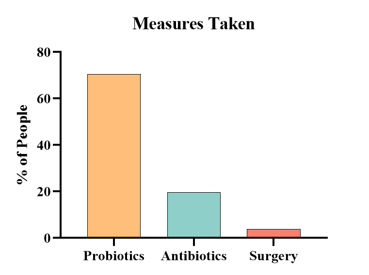
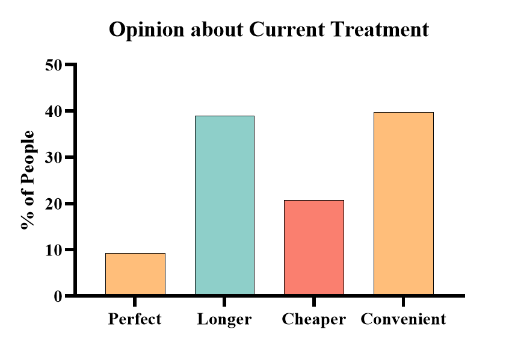
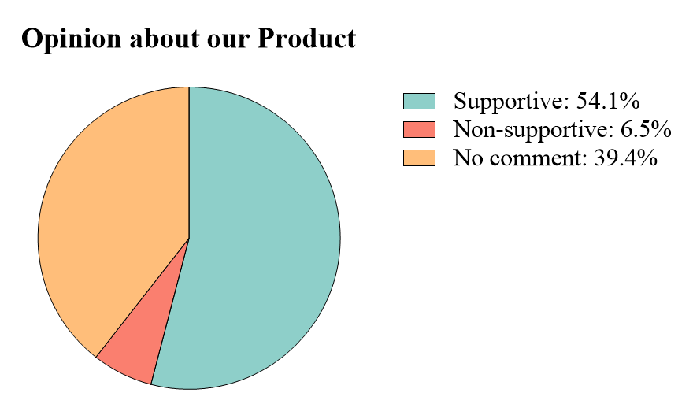
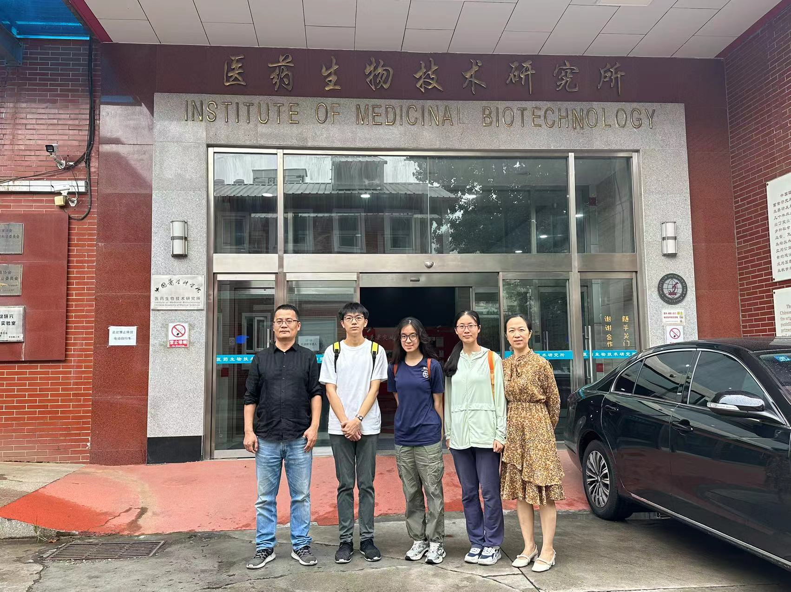

## 1. Overview

The human gut, home to trillions of microorganisms that form the gut microbiota, plays a crucial role in maintaining overall health. An imbalance in this microbial community, known as gut dysbiosis, can impact digestion, metabolism, immune function, and mental health. (Legan et. al, 2022)

This has become an increasingly prevalent and imperative issue, given the recent rise in the prevalence rate of diseases related to gut dysbiosis. Crohn's disease is chronic and currently incurable, similar to diabetes, while linked to gut dysbiosis. Additionally, seemingly unrelated disorders, such as Major Depressive Disorder, can find their roots in gut disorder, through the gut-brain axis. Our team is focused on developing solutions to alleviate gut dysbiosis-related symptoms and improve conditions for patients in the long run.

The issue gained further relevance when several teammates experienced upset stomachs due to increased academic pressure, reduced sleep hours, and reliance on fast food for lunch and dinner. All these matters are prevalent with local high school students local. This led us to investigate the prevalence of gastrointestinal disease in China, particularly in our local area, and we found the situation concerning. 

Our team focused on detecting common pathogens through both in vivo and in vitro methods, including strains like B. cereus and S. aureus targeted by 2022 and 2023 BNDS-China projects. Based on the idea of mediating key metabolites involved in Inflammatory Bowel Disease and Major Depressive Disorder, namely butyrate and IAA, we aim to expand the two pathways to apply to more scenarios that may lead to gut dysbiosis. We gathered feedback and suggestions to improve our project (feasibility) and taylor its use to a broader community (applicability).

In July, we interviewed a gastroenterologist about the background concerning gut dysbiosis. Her expertise greatly promoted our understanding of the nature of gut microbiota alterations and their relation to the subhealth dietary structure of modern humans. She also elaborated on the drawbacks of current probiotic products and suggested shifting our focus to alleviating the symptoms of patients in recovery or with mild disease. We were advised to consider the durability and colonization of our probiotics. She also enumerated synthetic biology's great potential in gastrointestinology's application.

Curious about potential alternatives to our probiotic platform and how our product would fare in the eyes of experts in the field, we subsequently interviewed a synthetic biologist about cutting-edge technologies and state-of-the-art designs utilized in pharmaceuticals and gut probiotics.

## 2.  Questionnaire to Beijing Residents

A survey questionnaire constitutes a convenient and effective method within the social sciences for data collection, facilitating the acquisition of relevant information in a period of time. To enhance the comprehensiveness of our project, we decided to implement questionnaires at the beginning of our Human Practice initiative. Consequently, during the summer vacation, we promptly distributed our questionnaires to a diverse of Beijing residents including various age groups and occupations. We extend our sincere gratitude to the Beijing residents who participated in the survey, thereby supporting our research endeavors.

In the initial phase of questionnaire development, we meticulously complied with the reflection cycle we established. This reflection cycle is composed of three core principles: 

1. Reflective: Clarifying our objectives to ensure that our human practice activities remain aligned with the overall goals of the project.

2. Responsible: Emphasizing reliability and care, ensuring that our activities adhere to fundamental requirements of safety, authenticity, and dependability, while taking responsibility for our project, the community, and the field of synthetic biology.

3. Responsive: Actively addressing and resolving issues based on the feedback obtained from the questionnaires.

Taking these elements into account, we precisely defined the objectives of distributing the questionnaires. Our primary aims were to assess the health status of Beijing residents concerning intestinal diseases, evaluate their understanding of the relationship between intestinal disorders and other health issues such as psychological conditions, and obtain their perceptions of existing treatment measures. Additionally, we hope to be clear with the public’s acceptance and opinions regarding our project’s products. These objectives were intended to validate the accuracy of our project’s goals and expectations and to ascertain whether the development efforts of other groups within our project were necessary and appropriately directed. Considering our location in Beijing and recognizing our limitations as high school students in terms of technical expertise and resources, we confined the scope of our questionnaire participants to Beijing residents. To capture a comprehensive understanding of diverse experiences, we distributed the questionnaires randomly and prepared versions in both Chinese and English.

Upon thorough consideration, we proceeded to formulate the questionnaire items. Excluding the initial question regarding participants’ ages, the questionnaire is divided into three sections. The first section involves questions 2-4, which inquire about participants’ knowledge of health issues such as gut diseases, gut dysbiosis, and the interplay between intestinal diseases and psychological disorders such as depression, as well as the general health situation of their gut. To facilitate participant comprehension and serve as a form of public education, these questions include specific examples (e.g., gut dysbiosis) and explanations of the terminology used. The second section, encompassing questions 5-10, explores whether participants have received treatment for intestinal issues, the specifics of such treatments, and their perceptions of existing treatment options. This section presents various situations and multiple-choice options, supplemented by examples to aid participants with similar experiences in making informed selections. The third section consists of questions 11 and 12, which assess participants’ understanding of the relevant aspects of our project’s products and their acceptance of our product. Following the design of the questionnaire, we promptly distributed it on online social platforms, striving to engage individuals from diverse backgrounds. After one week, we concluded data collection, collecting a total of 246 valid responses.

Subsequently, we commenced the analysis of these samples. The sample comprised 246 individuals, with age distribution predominantly between 18 years and under (40.2%) and 40-65 years (47.6%) (Figure 1). This distribution aligns with the demographic of Beijing residents who are active online and capable of participating in questionnaire responses, as well as representing student and parent groups.

<i>Figure 1. Age distribution of our sample.</i>

Analysis of the second question revealed that over half of the respondents (54.1%) possess some understanding of gut dysbiosis and related intestinal diseases, whereas less than half (40.2%) comprehend the relationship between intestinal diseases and psychological conditions (Figure 2). These findings indicate a moderate public awareness of intestinal health issues, underscoring the necessity for subsequent educational initiatives, such as public lectures, by our team.

<i>Figure 2. People's knowledge about gut dysbiosis.</i>

A significant proportion of participants (65.0%) reported experiencing intestinal discomfort or being diagnosed with intestinal diseases, highlighting the prevalence and severity of intestinal health problems among the surveyed Beijing residents. However, among those having symptoms only, only a minority (24.6%) sought hospital treatment, while the majority (53.8%) opted for self-management (Figure 3). This suggests a potential lack of urgency in seeking medical attention among Beijing residents, although it is important to consider that many participants may not belong to age groups with a high incidence of severe intestinal diseases, potentially influencing their decision to forgo medical consultation in the absence of severe symptoms.

<i>Figure 3. People's actions after experiencing intestinal discomfort.</i>

Regarding treatment measures, 70.5% of participants reported using gastric mucosal repair drugs or probiotics, with examples provided such as compound lactic acid bacteria tablets and Bifidobacterium tetragenicidium four-strain live bacteria tablets (noting that lactic acid bacteria and Bifidobacterium are probiotics). Additionally, 19.7% of participants utilized antibiotics (Figure 4). These data indicate a preference for pharmacological interventions, probiotics, and antibiotics as primary treatment modalities, likely due to their perceived effectiveness and convenience.

<i>Figure 4. Treatment measures taken by people with gut-related symptoms or disease.</i>

In assessing the effectiveness of treatments, 23.48% of patients noted symptom improvement at that time, however, the benefits were often not sustained, with instances of symptom recurrence observed. This finding highlights the limitations of current treatments and suggests a need for more enduring and effective interventions. Our product aims to address these shortcomings by providing a convenient and safe method to monitor symptoms proactively, thereby reducing the likelihood of recurrence.

When evaluating existing treatments, only 9.3% of participants deemed them "perfect", whereas over half (52.03%) expressed a preference for treatments capable of predicting and intervening in symptom development. Additionally, 39.02% desired more persistent treatment effects with reduced recurrence rates, and 39.84% sought more convenient treatments, preferably requiring a single intake with a shorter treatment cycle. Furthermore, 20.73% indicated a preference for more affordable options (Figure 5). These insights inform our product's target by highlighting the demand for a probiotic platform designed to colonize the human gut, thereby mitigating dysbiosis-related diseases. We aim to develop minimally invasive, long-term solutions that continuously monitor the intestinal environment, intervene before symptom onset, and restore microbial balance proactively.

<i>Figure 5. People's opinions about current treatment measures. "Perfect", that people perceive the current treatment as perfect. "Longer", that people desire longer-lasting treatment measures. "Cheaper", that people desire cheaper treatment measures. "Convenient", that people desire more convenient treatment measures.</i>

In the final two questions, participants were provided with a brief description of our product and subsequently asked about their acceptance and suggestions. Over half (54.07%) of the respondents found the product acceptable, while 39.43% chose not to evaluate (Figure 6). This indicates a moderate level of public acceptance, though the prevalence of non-responses suggests that technical terminology may have impeded understanding. This underscores the necessity for ongoing product refinement and efforts to build social trust. Additionally, among the limited feedback received, some participants expressed concerns regarding the potential side effects of our products.

<i>Figure 6. People's opinion about a comprehensive probiotic platform for treating gut dysbiosis.</i>

Overall, the questionnaire facilitated the identification of several key issues: intestinal diseases and gut microbiome imbalances are significant health concerns among Beijing residents, and there is a lack of long-term, predictive monitoring treatments in the market. The recurrence of symptoms further exacerbates patient inconvenience. Our products are designed to address these challenges. Moving forward, we plan to conduct expert interviews to enhance the professionalism of our project, ensure product safety, and establish greater maturity and responsibility towards the public. Based on the public's understanding of intestinal health issues, we will continue implementing educational campaigns. Additionally, we acknowledge the limitations of our questionnaire, including the restricted sample size and scope, and the potential for enhanced representativeness. We should minimize the use of technical language and give vivid examples to improve comprehension. Moreover, questions should be more detailed and comprehensive, addressing aspects such as the conditions under which participants experience intestinal discomfort, the frequency of symptoms, and whether stress exacerbates their intestinal issues.

In conclusion, this questionnaire activity has significantly contributed to honing our social science research skills and provided detailed insights that will facilitate the advancement of our products.

## 3. Interview with Gastroenterology Doctor Ms. Geng

From the literature we analyzed, we found that gut microbiota imbalance could lead to various diseases, most notably Crohn's disease and ulcerative colitis among Inflammatory Bowel Diseases (IBD). Focusing on gut dysbiosis, we're interested in its prevalence, especially in China in recent years. To ascertain the effectiveness of anti-inflammatory butyrate production in alleviating IBD symptoms, we're also curious about the severity of these diseases from a health worker's perspective. In addition, we sought professional advice that contrasts the advantages and drawbacks of our probiotic to screening methods and other mature products in the industry such as antibiotics. This will enable our further development of the probiotic platform to fit practical needs through feasible means. With those queries in mind, we interviewed Ms. Geng, a gastroenterology doctor in a private hospital in China, *United Family Healthcare* (Figure. 7).

<i>Figure 7. A BNDS-China member interacting with Ms. Geng during the interview.</i>

From our interview, we learned the following key points:

1. In accordance with our background research, intestinal disease prevalence has increased substantially since the last century, particularly in China. This could be attributed to people's deleterious dietary habits, particularly under the influence of fast-food culture. This suggests that apart from taking our probiotics, patients also need to adjust their eating preferences to accommodate the "MetaboMender." Therefore, we could integrate lectures on nutritionally balanced diets in conjunction with our project promotion during education events and design a tailored meal plan via mathematical modeling considering individual needs.

2. We learned in detail how intestinal flora is tightly interconnected with the immune system via signal transduction pathways and our emotions via regulating neural transmitters such as GABA and serotonin through the gut-brain axis. Learning about IAA's potentially negative influence on the gut environment and its relatedness to Major Depressive Disorder supported our intention to regulate its concentration when it's out of the optimum range of concentration. We were also inspired by the story of how IAA is also present in plants as the hormone auxin. The idea of integration - be it genetic pathways, different communities, or novel biotechnologies - is present throughout our project.

3. We used to target our probiotic product as a potential replacement for antibiotic treatment patients affected in the long term. Ms. Geng, however, stressed that doctors still resort to antibiotics for moderate and severe cases. Probiotics, on the other hand, are usually supplements rather than prescriptions unless schedules, dosages, and strains are specified. The problem with current probiotic supplements is that they hardly "supplement" individual gut microbiota because each is as unique yet similar as fingerprints. Relatively limited varieties of probiotic strains result in limited effects. In addition, most probiotics fail to reach and colonize the intended section of the gastrointestinal tract due to the human body's natural barriers and competitive exclusion that also protects our digestive system. Therefore, we slightly adjust our target groups from people in sub-health to those suffering mild symptoms.

## 4. Interview with Synthetic Biology Researcher Mr. Zhang

Ms. Geng mentioned that synthetic biology methods have high potential and application values for the future of gastroenterology, particularly for de novo drug design. To find out more about how synthetic biology is implemented under different scenarios, we interviewed Mr. Zhang whose research concentration is on the pharmaceutical potential of filamentous fungi through biosynthesis (Figure. 8).

<i>Figure 8. BNDS-China members, Mr. Zhang, and his college infront of the institute entrance.</i>

As a synthetic biology lab worker at the Institute of Medicinal Biotechnology in China, Mr. Zhang could offer us suggestions for improving project practicality and experimental design. We first explained our project background and experimental details to Mr. Zhang, followed by our interview with two main focuses: general questions on synthetic biology experiments, and specific questions about our project design.

1. After hearing our project description, Mr. Zhang expressed his astonishment at the completion and innovation of our project as a whole, but he also suggested some minor improvements. For the IAA degradation part, he mentioned that we should try to use one gene in the operon instead of three (iadCDE), which coincidentally fits the part where we had some trouble with the expression amount. We asked if adding three RBS before the ORF was feasible:  Mr. Zhang replied that it helps with the expression levels, but he still insists on using one gene for the operon, so that it reduces the pressure of the plasmid.

2. Mr. Zhang was especially impressed by our safety switch design, which he regards as a leading pioneer in China. He states that the lab safety protocols in China aren't that strict, which might lead to potential leaks and cause harm to society, so it is great for us to consider safety problems and provide a containment solution for our project.

3. We encountered some discrepancies with the essays we read while carrying out our wet lab, and we asked Mr. Zhang if it was normal. He replied with a hearty smile, admitting that this couldn't be more common in their daily research. He explains that it is an act of patent protection, and his advice for us is to repeat our experiments and try more instead of rigidly following the steps. Integrating multiple sources is also crucial for conducting our experiments smoothly.

4. For Mr. Zhang's opinions on the future applications of synthetic biology, he asserts that synthetic biology is already slowly entering our lives, mentioning the examples of biodegradable plastic and the mass production of artemisinin. There certainly will be challenges in the developing process, but through incorporating bioinformatics and other technologies, synthetic biology will soon grow into a booming industry.

## Collaboration

In iGEM and the synthetic biology community, collaboration is an essential integral part within and between teams. Collaboration has facilitated our communication of project ideas with other teams, strengthened our bonds, and confronting unprecedented problems together. Specifically, BNDS-China provided fluorescent bacteria used for agar art for UCAS-China in appreciation of their warm accommodations, gifts, and bonds to BNDS-China before 2018. In addition, BNDS-China had the privilege of engaging in a highly fruitful collaboration with NMU-China when we received the part PpChA for butyrate sensing and offered to do a biosensor docking simulation for NMU-China.

## References

Legan, T. B., Lavoie, B., & Mawe, G. M. (2022). Direct and indirect mechanisms by which the gut microbiota influence host serotonin systems. *Neurogastroenterology & Motility*, *34*(10), e14346.