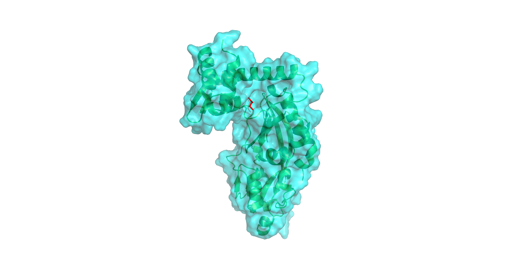
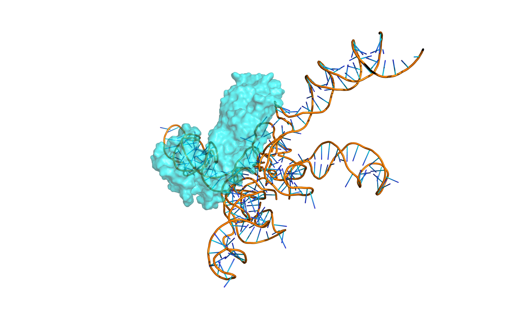
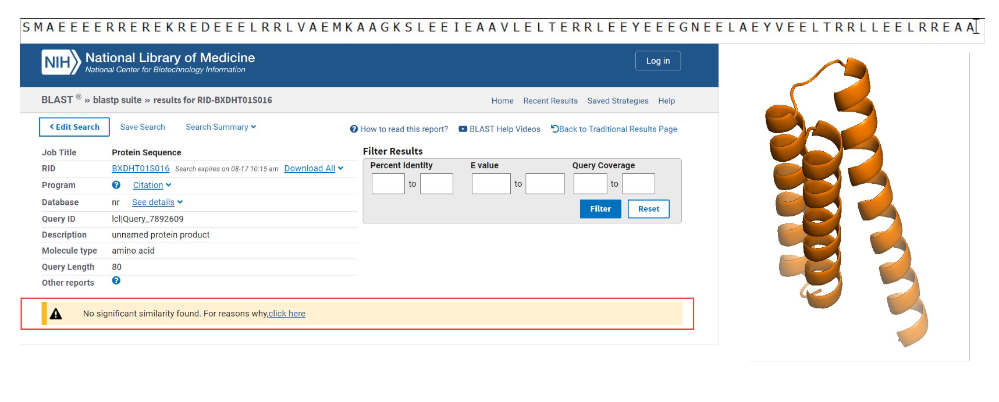
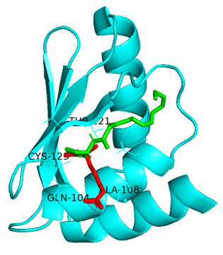
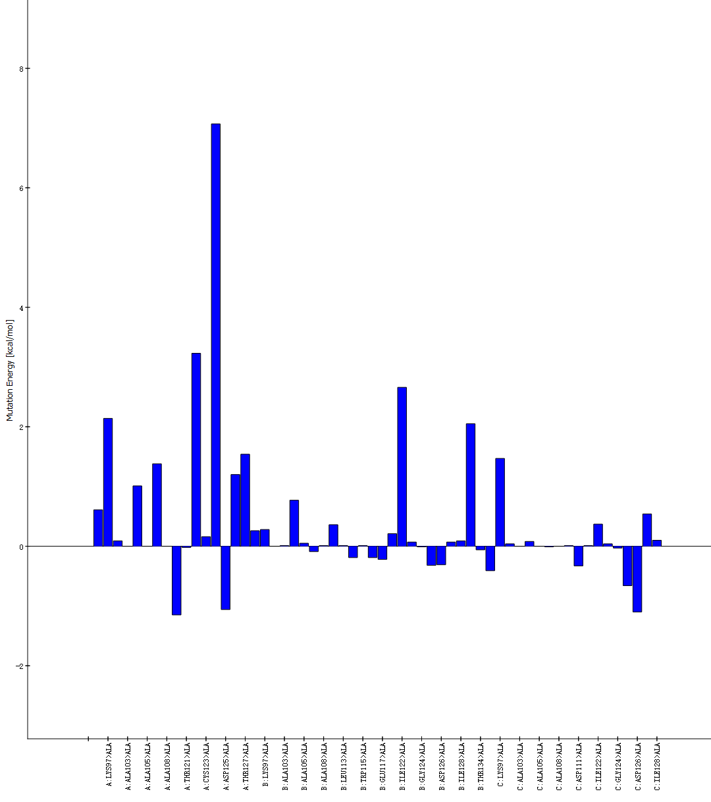
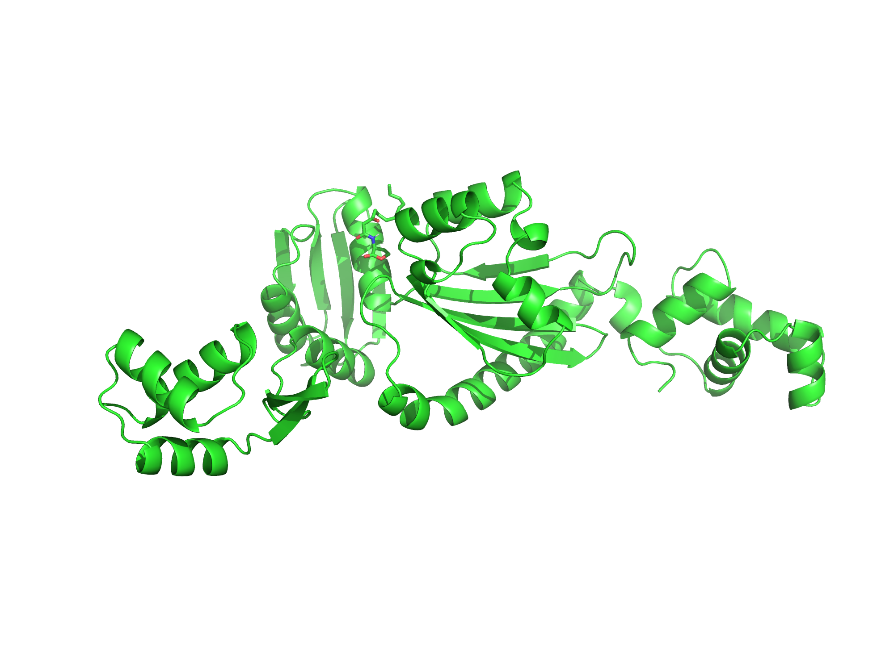
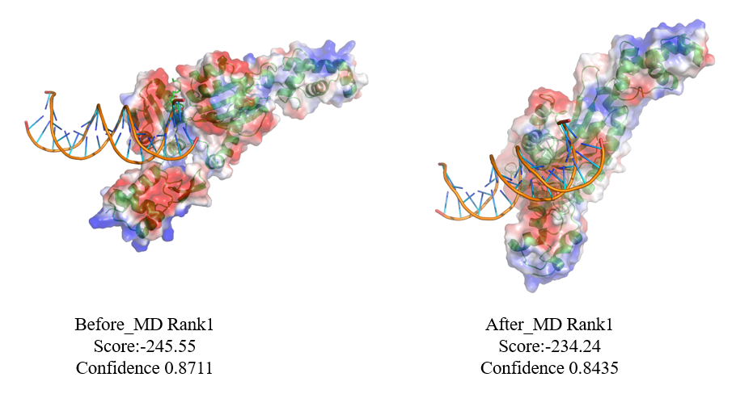

Modeling is essential to simulating and understanding dynamic systems and genetic parts in biology. We could subsequently improve our designs through the insights it provides. In synergy with our wet lab, modeling contributes to our ultimate implementation of the probiotic platform as a supplement product. Specifically, we are more equipped with the details about the genetic circuits, metabolic stress on chassis, biosensors functioning, and supplement administration to ensure the project feasibility and practicality. Next, we will expound on each corresponding model.

## 1. Genetic Circuit Calculator

The genetic circuit has multiple parts that compose an intricate relation web, influencing the yield of the final product. We hope to use a predictive stimulation model to gain a better understanding of how the circuit might function when changing different parts and promoters.

We establish a calculator that allows the user to identify an arbitrary circuit and output each parts’ concentration by time graph for analysis. The results of the models can serve as a reference for experiment, hardware, implementation.

### Assumptions and Parameters

By identifying the relationship between two parts we can correspond them into a differential equation, therefore by listing out a system of differential equations we are able to stimulate the function of logical gates and output concentration of the substances with python programming.
$$
\frac{dy}{dt}=\alpha\left(y_{\min}+(y_{\max}-y_{min})\frac{K^n}{K^n+x^n} \right)-\beta y
$$

**Equation 1, Stimulate Relationship**: when a part stimulates the expressing of another part, the two parts satisfy a differential equation

Where:

l y is concentration of the stimulated part

l x is concentration of the stimulator part

l   is the production rate constant

l   is the degradation rate constant

**Biological Interpretation**

Biologically, substance x stimulates the expressing of y, which means that higher concentrations of x should lead to higher concentration of y. When the concentration of x is very low, the growth of y reaches zero. That is, concentration of y would not grow without the existence of x.
$$
\frac{dy}{dt}=\epsilon P-\beta y
$$
**Equation 2, Repressing Relationship**: when a part represses the expressing of another part, the two parts satisfy a differential equation

Where:

l y is concentration of the repressed part

l x is concentration of the repressor part

l   is the production rate constant

l   is the degradation rate constant

l    is the minimum transcriptional output

l    is the maximum transcriptional output

l   is the half-maximal constant

l   is the hill constant

**Biological Interpretation**

Biologically, substance x represses the expressing of y, which means that higher concentrations of x should lead to lower concentration of y. When the concentration of x reaches a very high value, the expressing of y reaches zero, yet, in practice, the repression is not ideal, allowing minimum amounts of y to be expressed, we use the parameter  to demonstrate this phenomenon. 
$$
\frac{dP}{dt}=C-\beta P
$$

**Equation 3, Promoted Relationship**: when a part is promoted by the promoter, the part and the promoter satisfy a differential equation

Where:

l y is concentration of the part

l P is the transcriptional output of the promoter transcribing y

l   is the conversion factor.

l   is the degradation rate constant for y

**Biological Interpretation**

Biologically, promoter P promotes the expressing of y, meaning the higher the concentration of P the higher growth rate y would be. When the concentration of P reaches a very low value, the expressing of y reaches zero. That is, concentration of y would not grow without the output of P.

 

**Equation 4, Promoter rate**: Assuming the promoter works at a constant rate C satisfy a differential equation

Where:

l P is concentration of the promoter

l   is the constant rate the promoter works at

l   is the degradation rate constant for P

**Biological Interpretation**

Biologically, promoter P works at a constant rate of C, the final output of P would reach an equilibrium value due to degradation.

 

**3.**    **Basic assumptions**

**1. Assumption of Mass Action Kinetics:**

- Description: the rate of production and degradation of molecules     (e.g., mRNA, enzymes, metabolites like GABA) follows mass-action kinetics,     where the rate of change of concentration is proportional to the     concentration of reactants.
- Example: in the equation , the degradation of y is assumed to be directly proportional     to its concentration.

**2. Steady-State Production and Degradation:**

- Description: The system is assumed to reach a dynamic     equilibrium where the rates of production and degradation balance each     other over time.
- Example: the degradation rate constant  represents natural decay processes that are assumed to be     constant for each molecule type.

**3. Hill Function for Nonlinear Responses:**

- Description: the equations describing a repressing relationship     use Hill functions, which assume a cooperative binding process or a     threshold effect. This means that the response (e.g., transcriptional     output) is nonlinear and saturates at higher concentrations of the     effector molecule.
- Example: the term  suggests that the concentration of x affects the     transcriptional output of the repressed part in a nonlinear fashion.

 

**4.**    **Parameters**

Through the supplemental materials of papers, we find the parameters for the identical parts that are used in our experiment. For other parts, we adjust the parameters to fit the calculator’s outcome with our experiment data.

 

**5.**    **Application**

After constructing a graph of a genetic circuit, the user needs to input: the names of the proteins and promoters, the segments (starting from a promoter and ending at the terminator) of the circuit, the relations (repress or stimulate) between parts. The following is a simple example that verifies the validity of our calculator and an outcome for the circuit our team designed.

Actual graph:

Input:

The differential equation system constructed by the calculator:

Outcome graph:

Explanation:

From the actual graph, we see that protein  needs promoter  to transcript, hence, in the outcome graph, we see that  grows slowly at the beginning when the concentration of  is low. Furthermore, protein  represses promoter . Accordingly, as the concentration of  gets higher the growth rate of  decreases, and the concentration of  eventually falls due to degradation. Similarly, since protein  needs  to transcript, as the concentration of  decreases, the rate of growth of  also decreases. Finally, notice that the concentration of the repressed substance does not fall to zero, thus, simulating the actual situation rather than ideally modeling repression as a closing switch.

 

 

 

**6.**    **Conclusion**

Our calculator is capable of predicting any complex genetic circuit due to its generality, and its straightforward input system makes the calculator a simple tool for future teams to use. By inputting the structure of our team’s circuit and incorporating the basic mass action kinetic function and Hill function, the calculator predicts the results, visualizing the change of each substance and giving insights for experiment. It is also useful if we want to adjust the genetic circuit, preventing us to work from scratch and constructing a new model for the changed circuit. However, our current outputs are graphs of concentration as function of time, which might be less accurate considering the chemical reactions in the circuit produce products that are described as probability distributions rather than exact values. Therefore, our future goal is to establish a probability distribution predicting calculator. 

## 2. Metabolic Pathway Model

### Assumptions and Parameters

Carbohydrate->(Pyruvate,Valerate)

Glicerol->(Pyruvate)

Pyruvate->(Succinate,Lactate,Acetyl-CoA)

Succinate->(Valerate,Butyryl-CoA)

Lactate->(Pyruvate,Valerate,Acetyl-CoA)

Acetyl-CoA->(Butyryl-CoA,Acetate)

Acetate->(Butyrate)

Butyryl-CoA->(Butyrate)

Butyrate->(Acetyl-CoA)/Transportase

Acetyl-CoA->Acetyl-CoA

->TCA cycle negative feedback
$$
\frac{dP(t)}{dt} = r\cdot P(t) \left( 1 - \frac{P(t)}{P_{\max}} \right)-\lambda\cdot\frac{v_{\max}\cdot B}{K+B}
$$

## 3. Butyrate Biosensor Analysis

In our experiment, we found that the butyrate sensor, HpdR, has been unable to function properly. Therefore, we employed molecular dynamics simulation to try to identify our issue.

Firstly, we used Autodock-Vina to dock HpdR with butyrate, obtaining the static binding structure of the small molecule with the protein (Figure. 5).

<i>Figure 5. Structural diagram of protein HpdR binding to butyrate.</i>

Subsequently, we performed molecular dynamics simulation using Discovery Studio and conducted Hdock docking with DNA. The results showed that the docking score after molecular dynamics was higher than the docking score before molecular dynamics. The pre-molecular dynamics score was -306.7, and the post-molecular dynamics score was -322.08. This implies that after docking with butyrate, the docking between HpdR and PhpdH became more compact, which does not conform to the experimental results provided by the reference literature.

Upon analysis, we discovered that SarJ, a gene fragment in the biosensor, would tightly dock with the protein conformation after folding and butyrate docking, thereby blocking the transcription process (Figure. 6).

<i>Figure 6. The structure of protein HpdR after molecular dynamics simulation bound to DNA PhpdH.</i>

Later, we attempted to create PhpdH$\Delta$SarJ, but due to equipment failure, we did not obtain the final experimental results. We re-analyzed using the same method and obtained the following results (Figure. 7).

<i>Figure 7. The structure of protein HpdR before/after MD bound to DNA PhpdHΔSarJ</i>

We found that the protein docking score after 200ps of docking was somewhat lower compared to the protein-DNA docking score before the molecular dynamics simulation. Upon analyzing the active sites, we discovered that there was a noticeable release or a significant decrease in the bonding of nucleic acids in the RBS region. Therefore, we believe that SarJ is the cause of the experimental failure.

Next, we will attempt to repeat the experiment and believe that the results will confirm our analysis.

## 4. AHL Biosensor Design

In the human small intestine, 3-oxo-C12:2 (3OC12:2) is a specific factor, and we aim to identify a protein that allows the expression of a specific protein using 3OC12:2 as an inducer. Unfortunately, our literature search did not yield any relevant proteins.

### Attempt to generate an active site and perform homology modeling

First, we attempted to use RF diffusion to generate a model of a target protein that can bind with 3OC12:2. Then, we used the BLAST tool to search for transcriptional control proteins with similar binding sites for mutagenesis. Unfortunately, despite generating multiple target site sets for BLAST, we did not find suitable proteins (Figure. 1).

<i>Figure 1. Protein structures designed using RF Diffusion and BLAST results.</i>

### Attempt to identify target proteins with mutational potential

Since there were no proteins suitable for direct mutation of the active site, we attempted docking 3OC12:2 with common regulatory proteins. We found that AhrC, which interacts with arginine to regulate DNA transcription, can also dock with 3OC12:2 at similar sites (Figure. 2). Therefore, we decided to modify the AhrC protein structure in hopes of discovering an AhrC-like protein that can competitively bind to the target molecule and regulate downstream gene transcription.

<i>Figure 2. f.</i>

### Target Protein Analysis and Active Site Transfer

#### Structural Analysis of AhrC

**C-terminal domain**: Responsible for the recognition and binding of arginine, it is a key region for regulating the activity of the transcription factor. This region typically includes a pocket-like binding site suitable for interaction with arginine molecules. It involves some polar and charged amino acid residues, forming hydrogen bonds and electrostatic interactions with the guanidinium and carboxyl groups of arginine.

**N-terminal domain**: Responsible for binding to the promoter double-stranded DNA, regulating gene transcription. The structure of this region is relatively fixed and directly affects the transcriptional regulatory function of AhrC.

#### Analysis of the Active Residues of AhrC

Through alanine scanning analysis using Discovery Studio, we can essentially identify the arginine-binding site in the C-terminal of the protein, and the range of amino acids maintaining the pocket structure as 97-126 (with a free energy difference of greater than or equal to 1 after mutation). To maintain the pocket structure, we have decided to retain residues 68-146 from the crystal structure when transferring the pocket (Figure. 3).

<i>Figure 3. Alanine scanning results of AhrC small molecule docking domain.</i>

#### Modification of the Active Residues of AhrC

QsrC (PDB: 3SZT) is a protein that can dock with 3OC12. By analyzing its sequence and crystal structure, we can determine its active site and interaction with 3OC12. Since the difference between 3OC12 and 3OC12:2 lies in the double bond, we believe that the activity will not be significantly affected. Therefore, we transferred the entire active site region of QsrC to AhrC to obtain the final sequence.

#### Verification

We used Autodock-Vina to dock 3-oxo-C12:2 to the modified sequence and exported the complex structure using PyMOL (Figure. 4).

<i>Figure 4. The docking results of AhrC_like protein with small molecules.</i>

Afterward, we conducted molecular dynamics (MD) simulations using Discovery Studio. The simulation was performed with the CHARMM36 force field. Due to computational resource limitations, we could only simulate for 300 ps, but based on our energy analysis, we believe this is sufficient to observe some changes in the DNA docking site. While the simulation could not perfectly capture the two states of the protein before and after modification, we observed a trend where the protein becomes more compact after the small molecule binds.

Next, we used HDOCK to dock the DNA from the original crystal structure with the protein both before and after the molecular dynamics simulation. This allowed us to obtain theoretical values for the closeness and docking scores of the protein-DNA interaction, both before and after small molecule binding. We found that, compared to the pre-binding protein structure, the interaction between DNA and the protein showed a significant decrease due to the small molecule causing the protein structure to become more compact. The reduction in the number of bonds resulted in a meaningful drop in the docking score. We believe that with a longer MD simulation time, or in real experimental conditions, the DNA will be released, allowing transcription to be initiated (Figure. 5).

<i>Figure 5. Structure and score of AhrC_like protein before and after molecular dynamics binding to DNA.</i>

However, due to time and financial constraints, we are unable to validate this through further experiments at the moment. In the future, we plan to conduct ITC experiments or use assays like qPCR and Western Blot (WB) in E. coli to detect downstream products and verify our hypothesis.

#### Sequence of Protein

> sp|P17893|ARGR_BACSU Argininerepressor OS=Bacillus subtilis (strain 168) OX=224308 GN=argR PE=1 SV=1

MNKGQRHIKIREIITSNEIETQDELVDMLKQDGYKVTQATVSRDIKELHLVKVPTNNGSYKYSLPADQRFNPLSKLKRALMDAFVKIDSASHMIVLKTMPGNAQAIGALMDNLDWDEMMGTICGDDTILIICRTPEDTEGVKNRLLELL

> tr|G3XD77|G3XD77_PSEAEQuorum-sensing control repressor OS=Pseudomonas aeruginosa (strain ATCC 15692 /DSM 22644 / CIP 104116 / JCM 14847 / LMG 12228 / 1C / PRS 101 / PAO1) OX=208964GN=qscR PE=4 SV=1

<u>MHDEREGYLEILSRITTEEEFFSLVLEICGNYGFEFF</u><u>S</u><u>FG</u><u>ARAPFPLTAP</u>KYHFLSNYPGEWKSRYISEDYTSIDPIVRHGLLEYTPLIWNGEDFQENRFFWEEALHHGIRHGWSIPVRGKYGLISMLSLVRSSESIAATEILEKESFLLWITSMLQATFGDLLAPRIVPESNVRLTARETEMLKWTAVGKTYGEIGLILSIDQRTVKFHIVNAMRKLNSSNKAEATMKAYAIGLLN

> AhrC-like protein

MNKGQRHIKIREIITSNEIETQDELVDMLKQDGYKVTQATVSRDIKELHLVKVPTNNGSYKYSLPADQRFNPLSKLKRALMDAFVKIDSASHMIVLKTMPGNAQAIGALMDNLDWDEMMGTICGDDTILIICRTPEDTEGVKNRLLELLSFGARAPFPLTAPKYHFLSNYPGEWKSRYISEDYTSIDPIVRHGLLEYTPLIWNGEDFQENRFFWEEALHHGIRHGWSIPVRGKYGLISMLSLVRSSESIAATEILEKESFLLWITSMLQATFGDLLAPRIVPESNVRLTARETEMLKWTAVGKTYGEIGLILSIDQRTVKFHIVNAMRKLNSSNKAEATMKAYAIGLLN

> DNA sequence that combine with protein

CATGAATAAAAATTCAAG

## 5. Pharmacokinetics Model

As our goal is to design a probiotic supplement that could mediate key metabolites in the gut environment in the long run, determining the optimum drug dosage and dosage regimen to optimize therapeutic benefit is essential. We implemented the classical dose-response model in our probiotic scenario to retain a balanced effective drug concentration above 90% of the maximum with data from fluorescence kinetics experiments and literature review.

Here, we probe the best $T$ that you can wait between doses to peak up your microbiome population. The more this microbiome population is, the better efficacy of that drug will be. To this end, we propose a model where we consider logistic growth and population decay over time.

### Assumptions and Parameters

### Logistic Growth Model

Microbiome host populations essentially grow in line with the logistic growth function. This growth is limited by a carrying capacity $P_{\max}$, which stands for the maximum sustainable population that can be present in the gut. The rate constant $r$ governs the growth rate of the microbiome (i.e., how fast it replicates). We label the population at time $t$ as $P(t)$, that is evaluated according to:

$$
\frac{dG(t)}{dt} = r\cdot G(t) \left( 1 - \frac{G(t)}{G_{\max}} \right)
$$
This logistic growth function results in the population increasing leading up to $P_{\max}$ and then decreasing upon approaching this carrying capacity. The solution to this differential equation traces back to the classic logistic growth response:

$$
G(t) = \frac{G_{\max}}{1 + \left( \frac{G_{\max} - G_0}{G_0} \right) e^{-rt}}
$$
Where:

- $P_0$ is the initial population of the microbiome at $t = 0$,
- $r$ is the intrinsic growth rate,
- $P_{\max}$ is the carrying capacity of the gut microbiome.

### Loss Function

Along with this growth is a natural decay in population that occurs over time, due to various environmental factors or even possibly as an effect of the drug itself. Such decay can be thought of as a loss function that goes down exponentially. Denote by $\lambda$ the rate of decay of the microbiome population per unit time. The loss function $L(t)$ is then:
$$
\frac{dL(t)}{dt} = \lambda\cdot \left(G(t)-L(t)\right)
$$

$$
L(t) = G_0 e^{-\lambda t}
$$

This exponential decay is a representative of the slow elimination of population because of natural death and other lethal external factors.

### Periodic Dosing

What makes this model unique is the drug having to be administered periodically by this system. The drug dose $D$ will result in a fixed growth of $C$ in microbiota population for every administration (dose). In other words, the population gets an instantaneous bump every time $T$ amount of time has passed. Therefore, after the first dose at $t=0$, the population at the next dose time $T$ is suggested as:
$$
P(t) = G(t) - L(t)
$$
Where:

- $ G(t) $ is the growth function,
- $ L(t) $ is the loss function,
- $ C $ is the constant increase in population due to drug administration.

The subsequent doses at times $ 2T, 3T,\dots $ all behave similarly. After each dose, the population of microbiome increases by the constant $ C $, but it also grows and dies between doses based on logistic growth and loss functions.

### Dosing Interval Optimization

This model aims to determine the best period $ T $ that corresponds to the one where the microbiome population is maximized. This involves finding the $T$ that gives the greatest population immediately before each dose. To do this, we take the derivative of the expression for $ P(t) $, and then set it equal to zero.

$$
\frac{dP(T)}{dT} = 0
$$

Given this we get the optimal dosing interval $ T^* $ which trades-off population growth versus loss. Substituting the logistic growth, and loss functions into the population equation gives rise to trend or analytically solving with labels from 1.

$$
\begin{align}
	\frac{d}{dT} \left(\frac{r P_{\max} T}{1 + \left( \frac{P_{\max} - P_0}{P_0} \right) e^{-rT}} - P_0 e^{-\lambda T} \right)&=0
\end{align}
$$
Calculating $ T $ such that the number of individuals at each dosing interval is greatest can be done by solving this complicated equation numerically to determine the optimal $ T^* $.

### Cumulative Population Over Multiple Doses

We can also look long term to see how the microbiome population behaves after multiple dosing sessions. When $ n $ doses have been given, the population is:

$$
P_n = P_0 + nC + \sum_{i=1}^{n} \int_{(i-1)T}^{iT} \left( G(t) - L(t) \right) dt
$$
This can be estimated with the identity, where P is the solution to the logistic growth function.

$$
P_n \approx P_0 + nC + \frac{r P_{\max}}{1 + \left( \frac{P_{\max} - P_0}{P_0} \right) e^{-rT}} \left( 1 - e^{-\lambda T} \right)
$$
As can be seen in the above plot, the steady value of population is approached rapidly for large $ n $—the growth and loss, along with drug administration, balance out to form an equilibrium. The resulting steady-state population $ P_{\infty} $ will, therefore, be:

$$
P_{\infty} = \lim_{n \to \infty} P_n = \frac{r P_{\max} (1 - e^{-\lambda T})}{1 + \left( \frac{P_{\max} - P_0}{P_0} \right) e^{-rT}} + C
$$

### Conclusion

The model we presented here establishes a mathematical basis for optimizing the dosing interval $ T $ to maximize the abundance of microbiomes. To describe the way in which the microbiome interacts with an administered drug, we use a convolution of logistic growth and exponential decay. Thus the equation balancing the rate of population increase and loss that allows the population to level out before each dose determines the optimal interval $ T^* $. This will help the drug work its best.

## References
